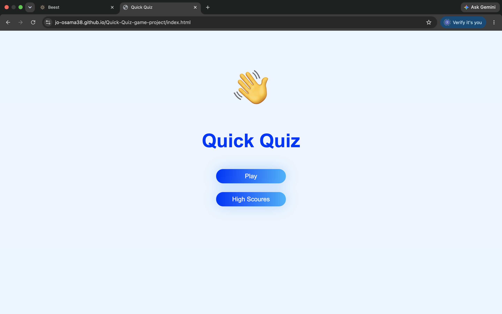
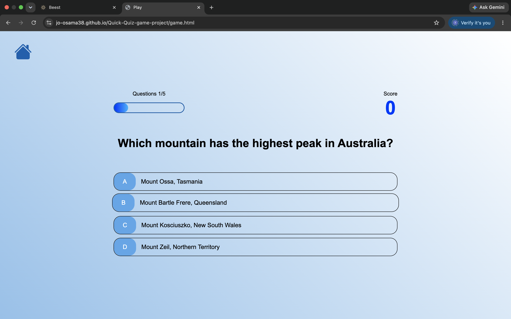
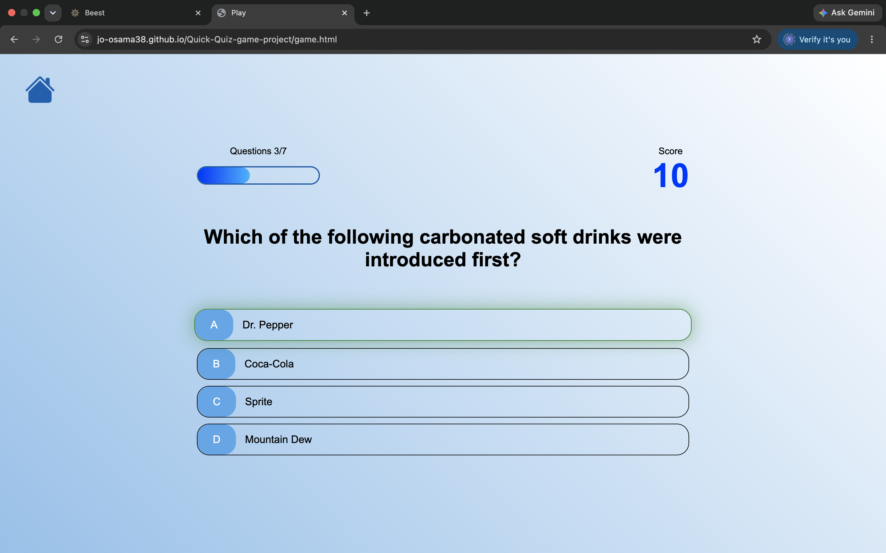
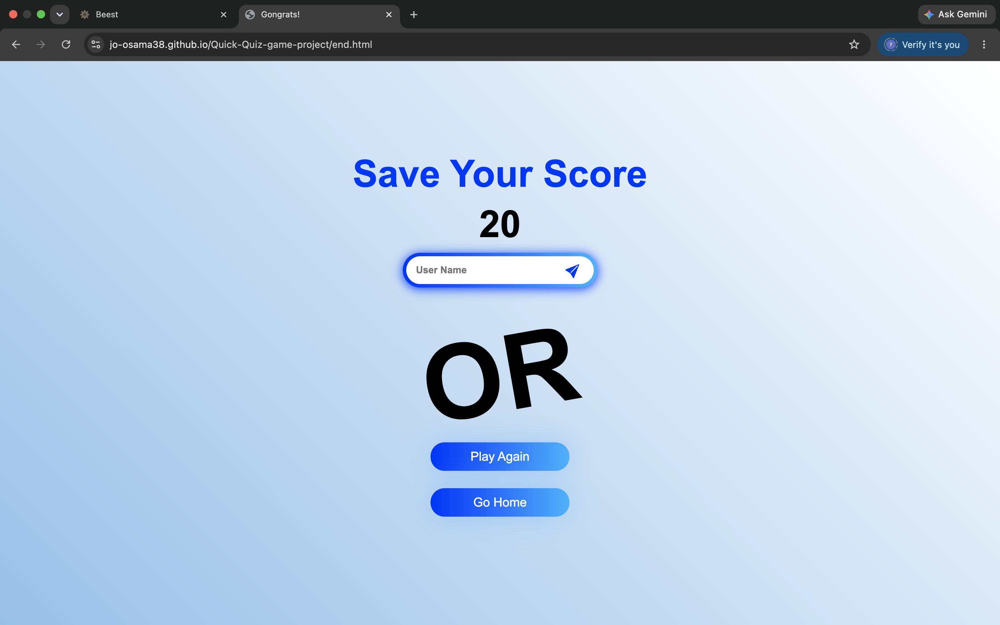
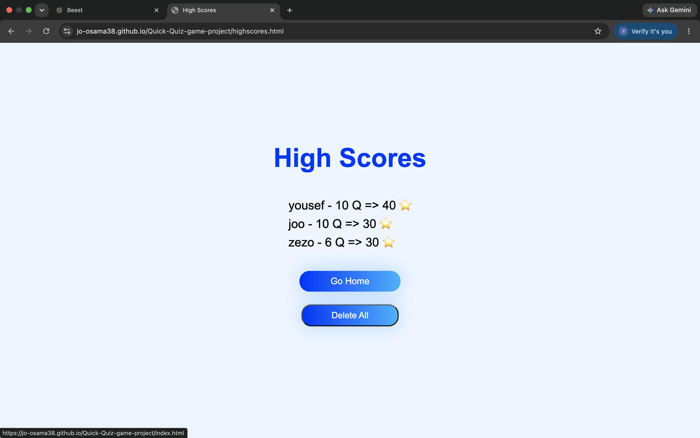

# English
The random general knowledge quiz game is a fun and educational game. It gets its questions from a trusted source with more than 3,600 reviewed questions along with their correct answers.

In this game, I built several pages. First, the welcome page, which appears when the game is opened. Second, the player page, which was the most challenging page for me, especially the CSS and JavaScript parts. Third, the end page, where the player's result is displayed based on their answers to the questions, and the score is saved to be shown on the fourth page, which is the high scores page

### What did I learn from this project?

I learned many new basic concepts in JavaScript and improved my skills in using Flexbox in CSS. I also learned how to work with APIs to fetch questions from a website and how to save data so that it remains available even after leaving the website.

### link video 

link : https://youtu.be/95c33ihDQCA?si=t10mqzt9Ible4lIK

## link game 

link :  https://jo-osama38.github.io/Quick-Quiz-/

# Arabic

لعبه الاسئله العشوائيه في المعلومات العامه اي لعبه مسليه وايضا تعليميه فهي تاخذ الاسئله من موقع موثوق به اكثر من 3600 سؤال مراجعين بالاجابه الصحيحه ايضا في هذه اللعبه بنيت بها اكثر من صفحه اولا صفحه الترحيب وهي الصفحه تظهر عند فتح اللعب وثانيا صفحه اللاعب نفسها كانت هذه اكثر صفحه اخذت مني وقت خاصه CSS وJavaScript ثالثا صفحه النهايه وهي التي يظهر فيها نتيجه اللاعب حسب اجابته على الاسئله ويتم فيها تسجيل نتيجه اللعب لعرضها في الصفحه الرابعه وهي صفحه اعلى النتائج

### ماذا تعلمت في هذا المشروع تعلمت فيه 

 الكثير من المفاهيم الاساسيه الجديده في جافا سكريبت واتطورت في استخدام Flex في CSS والتعامل مع الاي بي اي لجلب الاسئله الموقع وكيفيه حفظ البيانات حتى عند الخروج من الموقع تبقى موجوده

### لينك فيديو للمشروع

 لينك : https://youtu.be/95c33ihDQCA?si=t10mqzt9Ible4lIK 

### لينك لتجربه اللعبه

 لينك : https://jo-osama38.github.io/Quick-Quiz-/ 

#
#
# Image

#

#
### save your score here

#
### High Scores 

